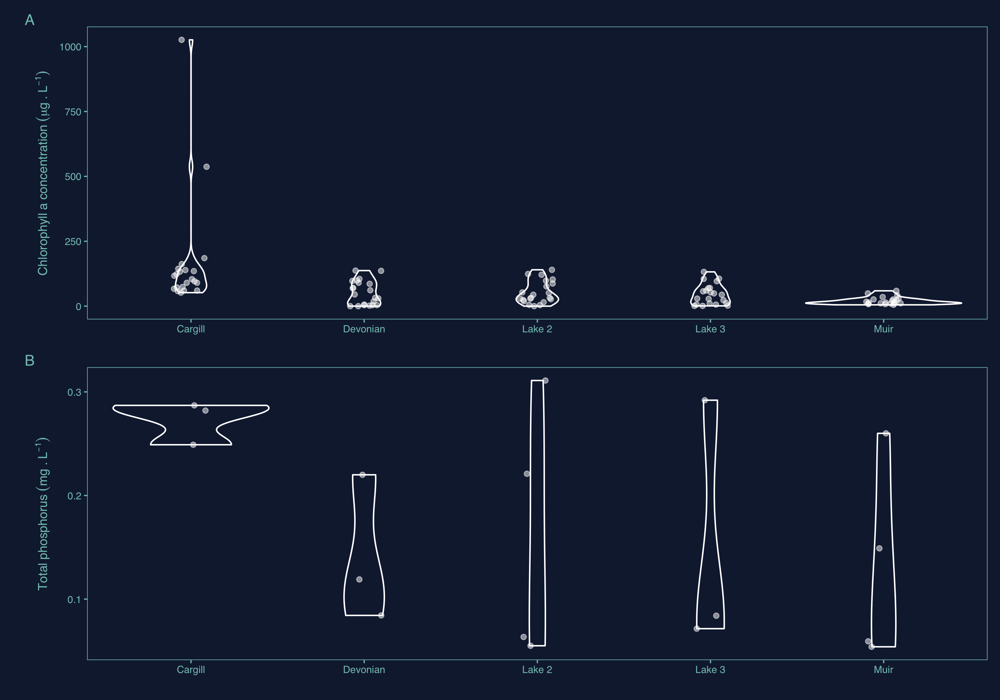

# Week 07 - Homework   {ggplot} part III

Welcome to your assignment for **week 7**. As usual, **Clone** this repo into your own :computer:  using RStudio, as we saw in class.

For this week's assignment you will need to create a short **"report" in an rmarkdown** format with its associated `.md` and `.html` outputs. 

## The data

For this week's assignment we are going to use two datasets from the [**FortWhyte Alive Model Watershed Project**](http://lwbin-datahub.ad.umanitoba.ca/dataset/fortwhyte-alive-model-watershed-project). The two datasets contain measures of chlorophyll *a* and a series of nutrients measured in the model lakes at FortWhite Alive. 

## Your tasks

1. As mentioned in class this week you are going to create your own ggplot theme. Like we saw in class, i want you to save this theme as a function in an speciffic `functions`folder so you can use it and access it in other projects. Make the theme your own. You can choose to make a professional looking one that you could use in publications later on, or you can make something fun!. Despite what i mentioned in class, includding colour scales (that can be used for the actual plot data) in the theme is not a default option, so dont worry about that for now, play with backgrounds, text, lines, etc.

2. The ultimate goal is to create a summary figure like this:

<!-- -->

This is not a replication exercise. This figure was made using a theme I created for this class, you will need to apply your own theme. Do try to keep the main elements related to the data itself.

The provided chlorophyll *a* and nutrient data are divided into the two different datasets, so the combined plot cannot make use of the `facet_wrap()` aproach we have seen in the past. In this case you will need to create two individual plots and merge them using the tools we have seen in class.

## wrap-up

In addition to being shown inthe final report, the final figure should be saved in `.pdf` format with a width of 190 mm

Finally, once you have completed the exercises, as usual:

- Once you are done with the R script files, save the changes, make sure scripts are properly saved in te **R** folder.
- Commit all the changes to the *repo/R project* (remember to write a commit mesage!)
- **Push** all changes back to **GitHub**
- Go to GitHub and check that it all worked out

## A few hints

- Make sure to save your `.rmd` file in the rmarkdown folder **before** you knit your file
- You will need to use the **{here}** package to correctly load the ditch data into the `.Rmd` file as well as to save the figures.

As always, feel free to use [the Issues](https://github.com/UM-R-for-EnvSci-Registered-Student/General-Discussion/issues) section of the of [General Discussion](https://github.com/UM-R-for-EnvSci-Registered-Student/General-Discussion) repo to ask any questions you might have or to share anny issues you come across. 

Note for those of you **still waiting for a final Git/GitHub set up**. You can still use the green button labelled "code" to download a zip version of the repository. You can unzip this anywhere in your computer and open the R project by double clicking the blue cube .RProj file. then you will be able to work on the project, edit and save like you would on any other R project.The only difference, for now, is that you will not be able to "push" the changes back to github, as that folder is not being tracked by Git/GitHub. We will need to find a separate solution for you to get this folder back to me once you are done with the asignment (e.g. zip eail attachment or dropbox/google drive/onedrive link)

Can't wait to see what themes you come up with!

*Happy coding!*

Pepe

