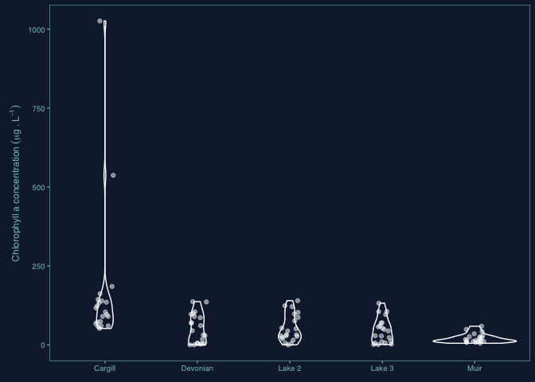
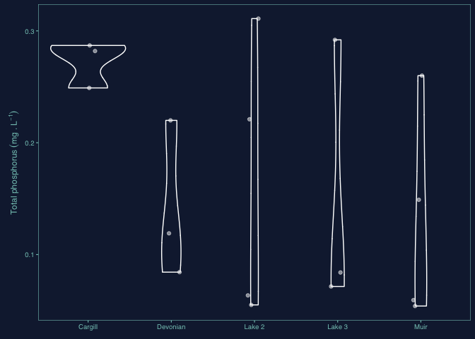
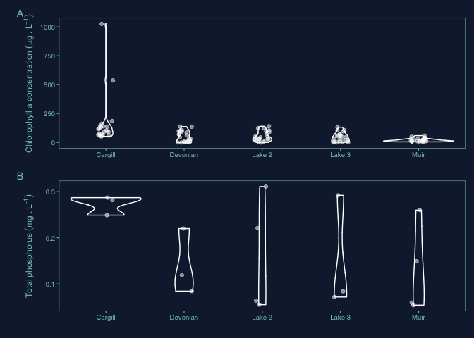

I have previously created my theme as a function in a separate r script file (`.R`) which has been saved in the `fucntions` folder. We need to source this function so it is available for us to use.

Feel free to go check the `.R` file to see how i created my Theme. I actually started from scratch instead of modifying an existing one, so i specified the values i wanted for all possible parameters.


```r
source(here("functions", "theme_pepe.R"))
```

We load the two data sets we are going to use for this execise. One containing the chlorophyll a data and the other with the phosphorus measurements. All data collected at **FortWhite Alive** and available [here](http://lwbin-datahub.ad.umanitoba.ca/dataset/fortwhyte-alive-model-watershed-project)


```r
chll_a <- read_csv(here("data", "chlorophyll_a.csv"))
```

```
## Parsed with column specification:
## cols(
##   lake_name = col_character(),
##   sampling_date = col_character(),
##   gps_coordinates_utm = col_character(),
##   latitude = col_double(),
##   longitude = col_double(),
##   sample_depth_m = col_double(),
##   `chlorophyll_concentration_ug/L` = col_double(),
##   `pheophytin_concentration_ug/L` = col_double(),
##   `total_chlorophyll_pheophytin_ug/L` = col_double(),
##   sample_volume_L = col_double(),
##   percent_filtered = col_double(),
##   chlorophyll_665nm_absorbancy = col_double(),
##   chlorophyll_750nm_absorbancy = col_double(),
##   pheophytin_665nm_absorbancy = col_double(),
##   pheophytin_750nm_absorbancy = col_double(),
##   notes = col_character()
## )
```

```r
phosphorus <- read_csv(here("data", "phosphorus_profiles.csv"))
```

```
## Parsed with column specification:
## cols(
##   sampling_date = col_character(),
##   lake_name = col_character(),
##   sampling_location_utm = col_character(),
##   latitude = col_double(),
##   longitude = col_double(),
##   sample_depth_m = col_double(),
##   `total_phosphorus_mg/L` = col_double(),
##   `total_reactive_phosphorus_mg/L` = col_double(),
##   `ammonia_total_as_N_mg/L` = col_double()
## )
```

# Plots

## Chlorophyll a plot

First we start with the chlorophyll a plot. As mentioned in the instructions, we want to create a summary plot of cholorophyll concentrations in the surface of the different lakes using the theme we have created. In this case, i am using a violin plot with a `geom_gitter()` to show the actual data.


```r
chll_a_plot <- chll_a %>% 
  clean_names() %>% 
  filter(sample_depth_m == 0) %>% 
  ggplot() +
  
  #Main plotting elements
  geom_violin(aes(x = lake_name, y = chlorophyll_concentration_ug_l), color = "white", fill = NA) +
  geom_jitter(aes(x = lake_name, y = chlorophyll_concentration_ug_l), color = "white", alpha = 0.5, width = 0.1, height = 0) +
  
  #scales
  # scale_y_log10() +
  # annotation_logticks(sides = "l", color = "white") +
  
  #theme and formatting
  theme_pepe() +
  labs(x = NULL,
       y = expression(Chlorophyll~a~concentration~(mu*g~.~L^{-1})))

print(chll_a_plot)
```

<!-- -->

## Phosphorus plot

Now we create the phosphorus. As mentioned in the instructions, we want to create a summary plot of total phosphorus concentrations in the surface of the different lakes using the theme we have created. In this case, i am using a violin plot with a `geom_gitter()` to show the actual data.


```r
p_plot <- phosphorus %>% 
  clean_names() %>% 
  filter(sample_depth_m == 0) %>% 
  ggplot() +
  
  #Main plotting elements
  geom_violin(aes(x = lake_name, y = total_phosphorus_mg_l), color = "white", fill = NA) +
  geom_jitter(aes(x = lake_name, y = total_phosphorus_mg_l), color = "white", alpha = 0.5, width = 0.1, height = 0) +
  
  # Scales
  # scale_y_log10() +
  # annotation_logticks(sides = "l", color = "white") +

  #Theme and formating
  theme_pepe() +
    labs(x = NULL,
       y = expression(Total~phosphorus~(m*g~.~L^{-1})))

print(p_plot)
```

<!-- -->

## Combined plot

Finally, we are going to use the`{patchwork}` package to create a combined plot.


```r
combined_plot <- chll_a_plot + p_plot +
  plot_layout(ncol = 1) +                  # We specify that we want them one on top of the other
    plot_annotation(tag_levels = "A") &    # We add the panel annotation so they can be referenced in the figure caption
  theme_pepe()                             # Using the `&` we can apply the theme also to the combined plot, 
                                           # this is needed to ensure my dark background is mainatined in the combined plot background

print(combined_plot)
```

<!-- -->

```r
ggsave(here("figures", "combined_plot.pdf"), combined_plot,
       width = 190, height = 140, units = "mm") 

ggsave(here("figures", "combined_plot.png"), combined_plot,
       width = 10, height = 7, units = "in") # i am saving a .png copy so i could embed it in the README.md
```

